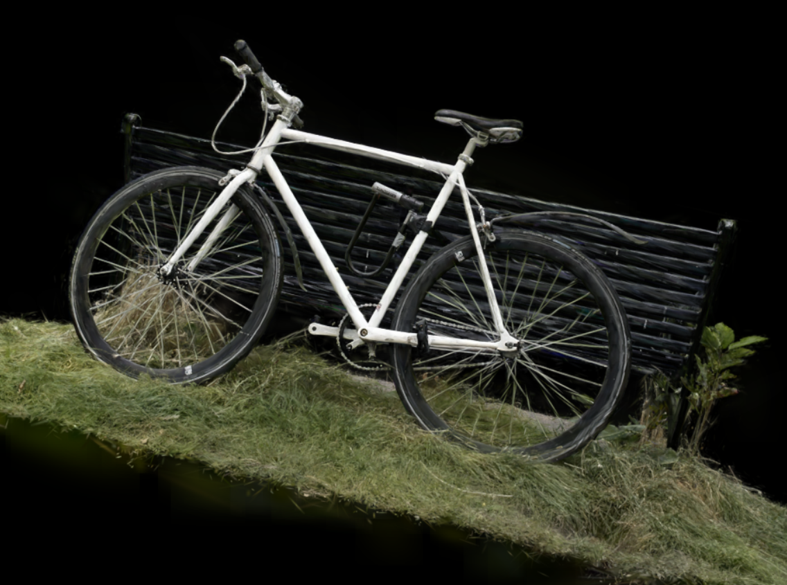
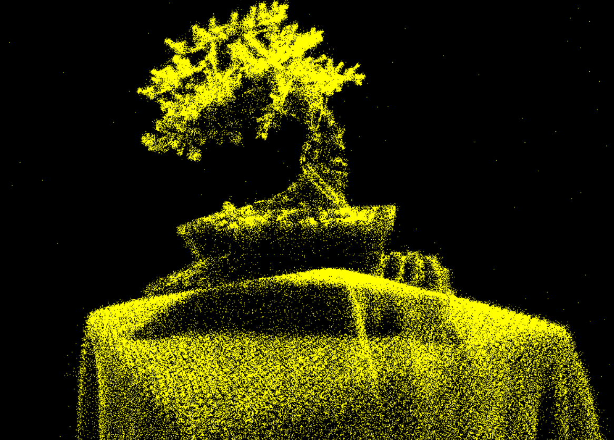
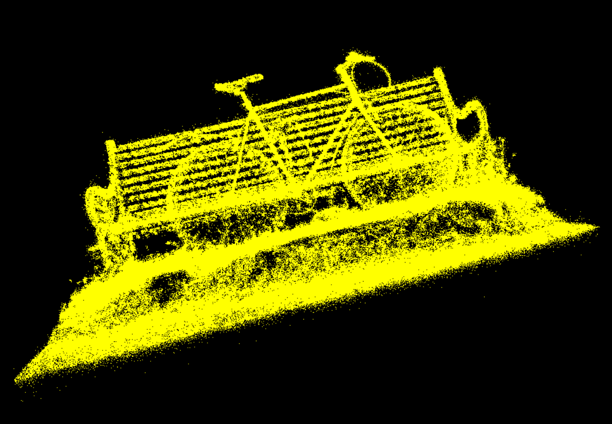
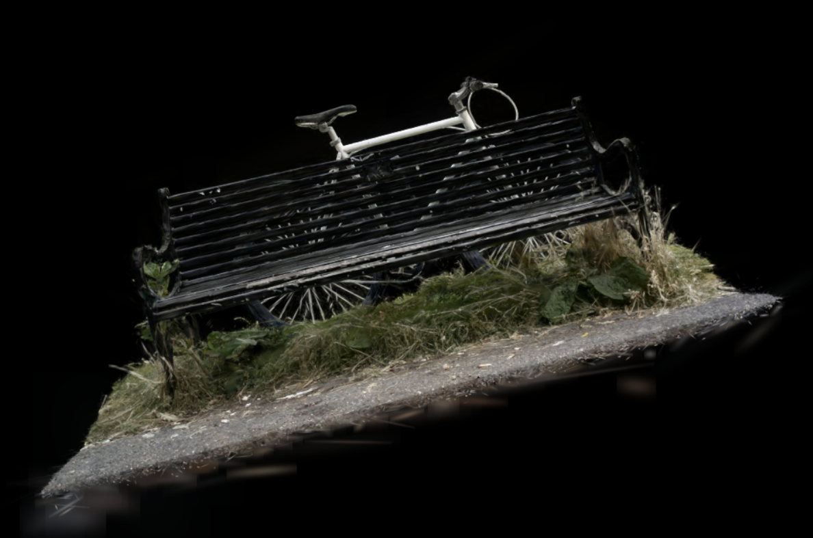
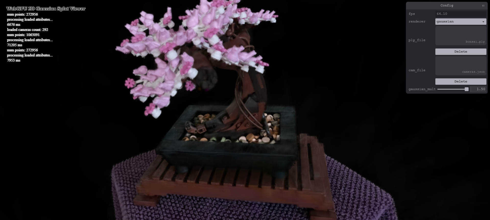
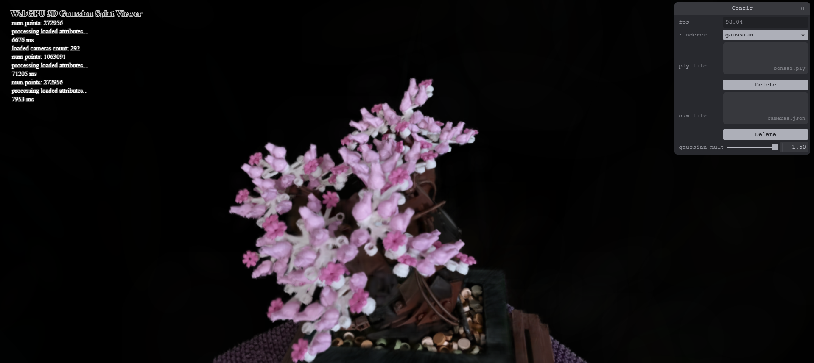
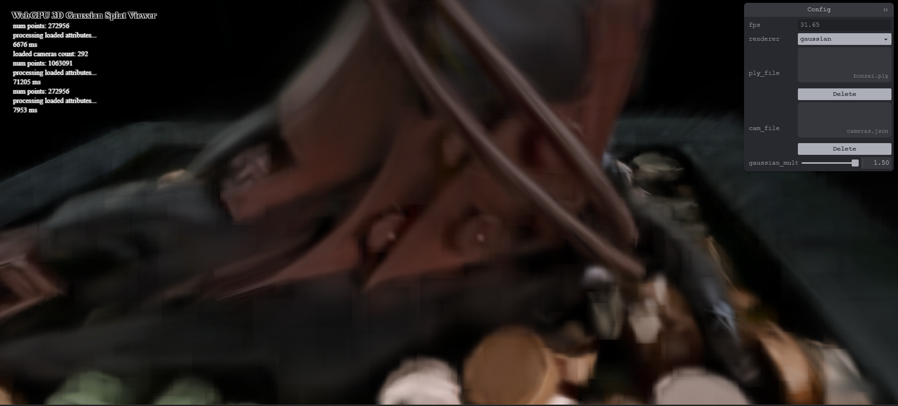

# Project5-WebGPU-Gaussian-Splat-Viewer

**University of Pennsylvania, CIS 565: GPU Programming and Architecture, Project 5**

* Aaron Jiang
  * [LinkedIn](https://www.linkedin.com/in/aaronpjiang/), [Personal Website](https://aaron-jiang.com/)
* Tested on: Windows 11, i5-13420H @ 1.99GHz 16GB, GTX 4050 16MB (Personal Computer)

### Live Demo
Click below to launch the demo in a new webpage. You will need a `.ply` to be able to load it. You may download the samples used in the examples below in this [Google Drive](https://drive.google.com/drive/folders/1Fz0QhyDU12JTsl2e7umGi5iy_V9drrIW?usp=sharing) 

### Demo Video/GIF

### Overview
This repository contains an implementation for the rasterization of Gaussian Splatting original proposed in [3D Gaussian Splatting for Real-Time Radiance Field Rendering](https://github.com/graphdeco-inria/gaussian-splatting).  Gaussian Splatting is a new technology for 3D scene representation using 3D Gaussians - that is, 3D volumes with Gaussian falloff in terms of transparency. These gaussian splats are also anisotrophic, allowing the display of thin and complex objects easily.

Included is both a point cloud renderer, for seeing the means of all splats, and the actual gaussian splat renderer. Previews for the results can be seen below.

| | Bonsai| Bicycle
|-|-|-|
| Point Cloud| |
| Gaussian Splatting|  |  

### Algorithm
The rendering algorithm for gaussian splatting consists of three parts. First, we preprocess the 3D Gaussians into 2D Gaussian data, ensuring our data is projected down to our camera. We also calculate the color for each splat by evaluating its spherical harmonic function. We also perform frustum culling to reduce the total number of Gaussians here. 
One challenge in rendering Gaussians is the amount of overlapping transparencies. In reality, there are cases where a Gaussian aiming towards the camera could have a further center point than another splat, but have regions of its splat that are in front of the other. However, this is not noticeable especially as Gaussian size goes down, so we will make the assumption that the fragment depth of each gaussian is in the same order as their centers.
For this reason, the second step is to sort the Gaussians back to front by view depth from the camera.
In the third step, for each splat, we will instance a plane that bounds the radius of the splat and utilize the distance from the center to figure out the opacity at that point. Since the instance data is sorted, the renderer will draw the splats back to front, ensuring that transparency is correct.

### Performance Analysis

Here are the base runtimes for both scenes in point cloud and gaussian modes. On each test, the model is centered taking up the majority of the frame.

#### FPS of Both Renderers
||Bonsai| Bicycle
|-|-|-|
|*Number of Splats*| *272,956* | *1,063,091*
|Point Cloud| 153 fps | 147 fps
|Gaussian Splatting| 47 fps | 9 fps

We see that point cloud rendering is relatively inexpensive compared to the rendering of Gaussian Splats. This makes sense as point cloud rendering is more simply visually. 
We also see that increasing the number of Gaussians drop the performance noticably. This is because each splat added will have to be drawn onto the screen on a instanced plane. The more splats there are, the higher density of splats and thus the more instances will need to be drawn.

#### FPS of Gaussian w.r.t. Workgroup Size

|Workgroup Size |FPS|
|-|-|
| Block Size 64 | 36 fps
| Block Size 128 | 46 fps
| Block Size 256 | 56 fps

The renderer performs better with higher block sizes. This is likely because larger blocks more effectively take advantage of shared memory to sort themselves. The sorting algorithm we are using is called Radix Sort, and using larger work groups allows for more shared memory to be relied upon when sorting within the work groups, which means less work later when combining the work groups together.
#### FPS of Gaussian w.r.t. Frustum Cullilng
The Gaussian renderer uses Frustum Culling at 120% to remove splats that will not contribute to the final image. This is seen in the following results.

|Image |FPS |
|-|-|
| | 64
| | 98
| | 147

As more of the scene is outside of the frustum, performance increases as the renderer needs to instance less splats. Counterintuitively, this effect is not noticed when zooming in to the model. This is because when zoomed in, the instance area for each gaussian is bigger, generating more fragments, which overpowers the performance gain by frustum culling.

|Image |FPS |
|-|-|
| | 64
| | 31

### Bloopers
This project dealt with a lot of matrix operations, which can lead to very weird results when things go awry. For example, here's when I multiplied the matrices `scale * rotation` when it should have been `rotation * scale`!
|X-Shaped Gaussians |
| - |

### Credits

- [Vite](https://vitejs.dev/)
- [tweakpane](https://tweakpane.github.io/docs//v3/monitor-bindings/)
- [stats.js](https://github.com/mrdoob/stats.js)
- [wgpu-matrix](https://github.com/greggman/wgpu-matrix)
- Special Thanks to: Shrek Shao (Google WebGPU team) & [Differential Guassian Renderer](https://github.com/graphdeco-inria/diff-gaussian-rasterization)
